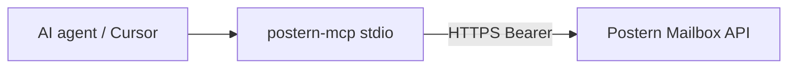

# postern-mcp

[](https://www.npmjs.com/package/@skyphusion/postern-mcp)

A [Model Context Protocol](https://modelcontextprotocol.io) server that exposes the
Postern mailbox to an AI agent. It is a thin, stdio MCP wrapper over the Postern
mailbox API (the same token-gated endpoints the IMAP proxy uses), so an agent can use
the mailbox as a knowledge base and, when explicitly enabled, send mail.

Stack map: [docs/architecture.md](../docs/architecture.md).



- **Read tools** (always on): search, list, read a message, read a thread.
- **Send tools** (v1.1, **opt-in**): `mailbox_send` / `mailbox_reply`, registered when
  a send credential is configured (see env below).
- **Multi-person use (#544):** give each person a **per-identity registry token** with
  `"scopes": ["read"]` (or `["read","send"]`) and put **that** token in
  `POSTERN_API_TOKEN`. The worker forces every read to that identity. Do **not** share
  an estate `POSTERN_API_TOKEN` / `_READ` across people -- that credential is
  estate-wide by design. See [docs/SEND-IDENTITIES.md](../docs/SEND-IDENTITIES.md).

## Tools

### Read (scope `read`)

| Tool | What it does | Wraps |
|---|---|---|
| `mailbox_search` | Search subject + body, newest-first. `mode` defaults to `hybrid` (semantic + keyword); other modes: `fts`, `semantic`, `substr` (literal substring; pair with `field` = `subject`/`body`/`text`). Optional `direction` (`inbound`/`outbound`, the stored fact), `to` / `from`, `lens` (`inbox`/`sent`, one address's view, needs `to`), `mailbox` (`archive`/`trash`/`junk`/`all`, durable folder), `after` / `before` (inclusive ISO date bounds), `hasAttachment`, `seen` (read state), `seenFor` (whose read state `seen`/results render; for a shared/role address with no reader of its own), `limit`, `cursor`. `mode=fts` requires every word of the query, so an empty result really means not-here. **The primary tool.** | `GET /api/search` |
| `mailbox_list` | Browse/filter by `to` / `from` / `direction` / `thread` / `mailbox` (`archive`/`trash`/`junk`/`all`), paginated via `cursor`. `direction` is the stored fact (`to=X&direction=inbound` = what ARRIVED for X, never our sent copy); `to=X&lens=inbox\|sent` is X's own view. `lens` needs `to` and is not combinable with `direction`. `seenFor` names whose read state the `seen` field renders, for a shared/role address with no reader of its own. | `GET /api/messages` |
| `mailbox_get` | Fetch one full message (headers + body text + attachment metadata) by `message_id`. | `GET /api/messages/{id}` |
| `mailbox_get_attachment` | Fetch one attachment as base64 **bytes** by `message_id` + zero-based `index` (the index into the `mailbox_get` attachment metadata). Returns `filename`, `mimeType`, `size`, `content` (base64). Oversize attachments are **refused with a clear error, never truncated** (cap: `POSTERN_MCP_MAX_ATTACHMENT_BYTES`, default 5 MiB). | `GET /api/messages/{id}/attachments/{i}` |
| `mailbox_thread` | Fetch every message in a thread by `thread_id`. | `GET /api/threads/{id}` |

### Send (scope `send`, opt-in)

| Tool | What it does | Wraps |
|---|---|---|
| `mailbox_send` | Send a NEW email. Provide `to`, `subject`, and at least one of `text` / `html`. Optional `cc`, `bcc`, `from`, `reply_to`, and `attachments` (each `content` base64 + optional `filename`, `mime_type`). The worker caps attachment count and total size and rejects an oversize set with a clear error. With a per-identity token the worker stamps `From` to the bound identity; any caller `from` is discarded. | `POST /api/send` |
| `mailbox_reply` | Reply to a stored message by `message_id` (provide `text` and/or `html`). The server fills `to` / `subject` / `In-Reply-To` / `References` / thread, so the reply lands in the same conversation. Optional `cc`, `bcc`, `from`, `mode` (`reply` default, or `replyAll` to include the original recipients, derived server-side from stored state), `quote_original`, and `attachments` (same shape and worker-enforced caps as `mailbox_send`; carried by `/api/reply` since #363). | `POST /api/reply` |

Send tools are **MUTATING**: they deliver mail. They register only when a send token
is present (see below). The server owns From-enforcement, DKIM signing, threading, and
storing the sent copy; the tools forward a composed message and return the core
`messageId` + `threadId`.

Each tool returns pretty-printed JSON. Errors come back as an MCP `isError` result
with a clear message (never a thrown exception) -- including the worker's own reason
on a 400/401/403 (e.g. `requires send scope`, `invalid to address: ...`).

## Install / build

**From npm** ([@skyphusion/postern-mcp](https://www.npmjs.com/package/@skyphusion/postern-mcp); tag
`postern-mcp-v*` triggers CI publish):

```bash
npx -y @skyphusion/postern-mcp   # requires POSTERN_API_URL + POSTERN_API_TOKEN in env
# or: npm install -g @skyphusion/postern-mcp && postern-mcp
```

**From this repo** (development):

```bash
cd mcp
npm install
npm run build      # compiles src -> dist (tsc)
```

Runtime deps are minimal: the MCP SDK and zod. Node >= 18 (uses the global `fetch`).

### Cursor / Claude MCP config (npm)

```json
{
  "mcpServers": {
    "postern": {
      "command": "npx",
      "args": ["-y", "@skyphusion/postern-mcp"],
      "env": {
        "POSTERN_API_URL": "https://your-postern-api.workers.dev",
        "POSTERN_API_TOKEN": "<read-scoped Postern token>"
      }
    }
  }
}
```

## Configure it in Claude Code

Add an entry to your MCP client config (e.g. `.mcp.json`, or via `claude mcp add`).
Prefer `npx @skyphusion/postern-mcp` from npm (see [Install / build](#install--build)); for local
dev, point at the built `dist/index.js`. Pass the API origin + a **read-scoped** token
in `env` (never put the token in a tracked file):

```json
{
  "mcpServers": {
    "postern": {
      "command": "node",
      "args": ["/absolute/path/to/postern/mcp/dist/index.js"],
      "env": {
        "POSTERN_API_URL": "https://your-postern-api.workers.dev",
        "POSTERN_API_TOKEN": "<read-scoped Postern token>"
      }
    }
  }
}
```

Equivalent CLI form:

```bash
claude mcp add postern \
  --env POSTERN_API_URL=https://your-postern-api.workers.dev \
  --env POSTERN_API_TOKEN=<read-scoped token> \
  -- node /absolute/path/to/postern/mcp/dist/index.js
```

For production, use `"command": "npx", "args": ["-y", "@skyphusion/postern-mcp"]` (see [Cursor / Claude MCP config](#cursor--claude-mcp-config-npm)).

## Configuration

| Env var | Required | Default | Meaning |
|---|---|---|---|
| `POSTERN_API_URL` | yes | -- | the Postern mailbox API origin |
| `POSTERN_API_TOKEN` | yes | -- | Bearer for **read** tools. Prefer a **per-identity registry** token with `scopes` including `read` (#544). An estate `POSTERN_API_TOKEN` / `_READ` remains estate-wide. |
| `POSTERN_SEND_TOKEN` | no | (unset) | Bearer for **send** tools. When set, send tools register and use it. With a per-identity token the worker binds From. **Mutating; opt-in.** |
| `POSTERN_MCP_SEND` | no | (unset) | Set to `1` to register send tools using `POSTERN_API_TOKEN` as the send credential (for a single registry token with `scopes: ["read","send"]`). |
| `POSTERN_API_TIMEOUT_MS` | no | `15000` | per-request timeout (ms) |
| `POSTERN_MCP_MAX_ATTACHMENT_BYTES` | no | `5242880` (5 MiB) | max bytes `mailbox_get_attachment` will return; a larger attachment is **refused with a clear error, never truncated**. Raise it (up to the API-side 25 MiB ceiling) for hosts that tolerate bigger tool results. |

Every request carries a custom `User-Agent` (`postern-mcp ...`). The API sits behind
Cloudflare, which 403s default bot user-agents ("error 1010"), so this is mandatory.

`stdout` is reserved for the JSON-RPC transport; all server logging goes to `stderr`.

## Send tools (v1.1, opt-in)

Tool registration is **scope-gated** (`src/tools.ts`): each tool declares the scope it
needs and `registerTools` registers only those the configured credentials satisfy.

- Without `POSTERN_SEND_TOKEN` and without `POSTERN_MCP_SEND=1`, the server is read-only
  -- send tools are not registered.
- With `POSTERN_SEND_TOKEN` (or `POSTERN_MCP_SEND=1` reusing `POSTERN_API_TOKEN`), the
  server registers `mailbox_send` / `mailbox_reply` on a send client.

This mirrors the server-side per-function token split (#85): the worker resolves a
`send`-scoped token to the `send` scope, which returns `200` on `POST /api/send` and
`/api/reply` but `403` on `/api/search` and `/api/admin/*`. So even if a send token
leaked, its blast radius is bounded to sending; it cannot read or administer.

The boot-level gate is proven by `npm run smoke` (`scripts/stdio-smoke.mjs`) and
unit-covered in `test/send-tools.test.ts`.

## Per-identity credentials (read + send)

Tokens in `POSTERN_SEND_IDENTITIES` bind to one address. Optional `scopes` (#544):

- `"scopes": ["send"]` or omitted -- send-only (historical default).
- `"scopes": ["read"]` -- MCP/agent **read** credential forced to that mailbox.
- `"scopes": ["read", "send"]` -- one token for both; set as `POSTERN_API_TOKEN` and
  `POSTERN_MCP_SEND=1` (or also set `POSTERN_SEND_TOKEN` to the same value).

Authoritative contract: **[`docs/SEND-IDENTITIES.md`](../docs/SEND-IDENTITIES.md)**.

How it works (the MCP client implements none of it; the worker is authoritative):

- The worker holds one config var `POSTERN_SEND_IDENTITIES` mapping the **sha256 hex
  of a raw token** to `{ from, displayName?, scopes? }` (hashes, never raw tokens; it
  holds no credential, so it is a readable var, not a secret -- #335).
- **Send:** on `POST /api/send` / `/api/reply`, a registry token with the `send` cap
  has outbound `From` overridden to the bound identity; any caller `from` is discarded.
- **Read (#544):** on list/search/get, a registry token with the `read` cap is forced
  to that identity's mailbox (+ role queues). Estate static tokens stay estate-wide.
- An unknown token is `401`; a token without the needed cap is `403`. A registry
  `from` off `ALLOWED_FROM_DOMAIN` fails loud, nothing sent. Full table:
  `docs/SEND-IDENTITIES.md` section 6.

**Operator wiring (one agent, one identity):**

1. Register `sha256hex(token) -> { from, scopes: ["read"] }` or `["read","send"]`
   (`docs/SEND-IDENTITIES.md` section 7).
2. Put the **raw** token in that agent's MCP `POSTERN_API_TOKEN` (out of band).
3. For send with the same token: set `POSTERN_MCP_SEND=1`, **or** set
   `POSTERN_SEND_TOKEN` to the same value. For a separate send-only registry token,
   put that in `POSTERN_SEND_TOKEN` only.

Do not put an estate `POSTERN_API_TOKEN` / `_READ` into multi-person MCP configs.

### Rollout: opt-in per identity (deliberate toggle)

Sending is a mutating capability, so it ships **off until a send credential is present**
(`POSTERN_SEND_TOKEN` or `POSTERN_MCP_SEND=1`). Read tools always register. Enabling
send for an agent is a deliberate, gated step -- register the identity, hand out the
raw token, set env. Until that toggle is flipped, the send tools do not exist at
runtime. Do not wire send into shared/default agent config silently; each agent gets
its own identity-bound token.

## Security

- Tokens are read from the environment only and never logged. Prefer a
  **per-identity registry** token with `scopes: ["read"]` for multi-person use.
- A leaked token is bounded by its caps: read cannot send; send cannot read or
  administer (#85). A registry token can only act as its bound identity (From on
  send; forced viewer on read -- #544).
- The registry stores token **hashes**, never raw tokens; reading the deploy var
  yields no usable credential (`docs/SEND-IDENTITIES.md` section 5).
- Do not commit a real token. `.env.example` is a reference only.

## Develop

```bash
npm test         # vitest: client + tools + send + registration units
npm run typecheck
npm run build && npm run smoke   # boots the built server over stdio and asserts the scope gate
```

`npm run smoke` proves the opt-in gate end to end at the process level: a read-only
env exposes exactly the five read tools, and adding `POSTERN_SEND_TOKEN` adds
`mailbox_send` + `mailbox_reply`. Live request scope-gating (a read token gets `403` on
send, a send token `403` on read) and the per-identity From-binding are enforced by the
worker (#85, #138); the authoritative contract is
[`docs/SEND-IDENTITIES.md`](../docs/SEND-IDENTITIES.md). The end-to-end
verification (two-party, live worker: spoofed same-domain `from` overridden to
the token's bound identity for every registered token, unknown token 401) was
run 2026-06; the record is maintained in the operators' private infrastructure
repository.

## License

MIT (see [LICENSE](LICENSE)). The Postern server core is AGPL-3.0; this client
integration is MIT to maximize reuse, matching the other Postern clients.
